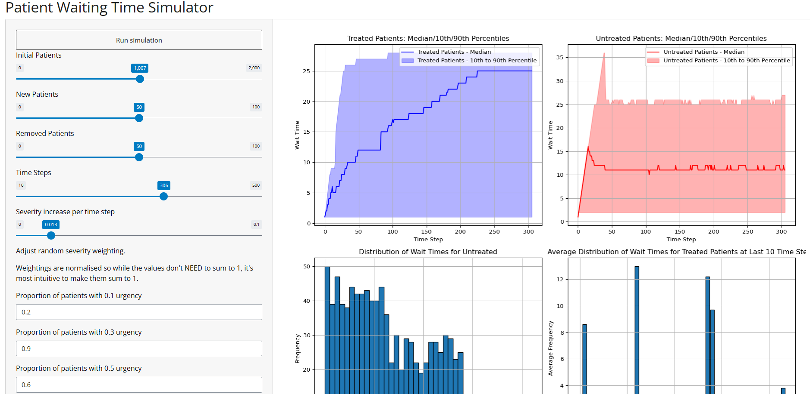

# Patient Waiting Time Simulator: A Python Shiny App

This application visualizes the waiting time of patients based on a set of factors and conditions. Users can adjust various parameters, including initial patient counts, urgency levels, time steps, and more, to gain insights into the dynamics of waiting times in hypothetical healthcare scenarios.

## Features

- **Interactive UI**: Utilizes Python's Shiny library to offer an intuitive user interface.
- **Dynamic Plotting**: Generates plots based on real-time inputs to visualize median, mean, and percentile waiting times.
- **Patient Urgency Simulation**: Employs a weighted urgencies technique to simulate patient urgency based on user-defined proportions.

## Screenshot



## How it Works

1. **Initialization**: The application initializes with a number of patients each assigned a level of urgency. Urgency is determined by weights set by the user.
2. **Time Progression**: As time steps progress, patients' urgencies increase. Patients are also admitted and removed during each step.
3. **Data Visualization**: The application produces multiple plots showing median and mean waiting times, distributions of waiting times, and percentiles.

## Code Structure

- **Patient Class**: Represents individual patients, with attributes like wait time and urgency.
- **Functions**: Utility functions handle the creation and removal of patients, and the calculation of metrics like median, mean, and percentiles of waiting times.
- **UI & Server**: Shiny UI components are utilized for the layout and widgets. The server function processes the user inputs and updates the visual outputs accordingly.

## How to Run

1. Ensure you have the required libraries installed:
   ```
   pip install matplotlib numpy shiny
   ```

2. Run the application using Python:
   ```
   shiny run app.py
   ```

3. Interact with the simulator via the browser.

## Conclusion
The Patient Waiting Time Simulator provides a visual aid in understanding the dynamics of patient waiting times in a healthcare setup. By adjusting parameters, users can simulate various scenarios and study their impact on wait times.